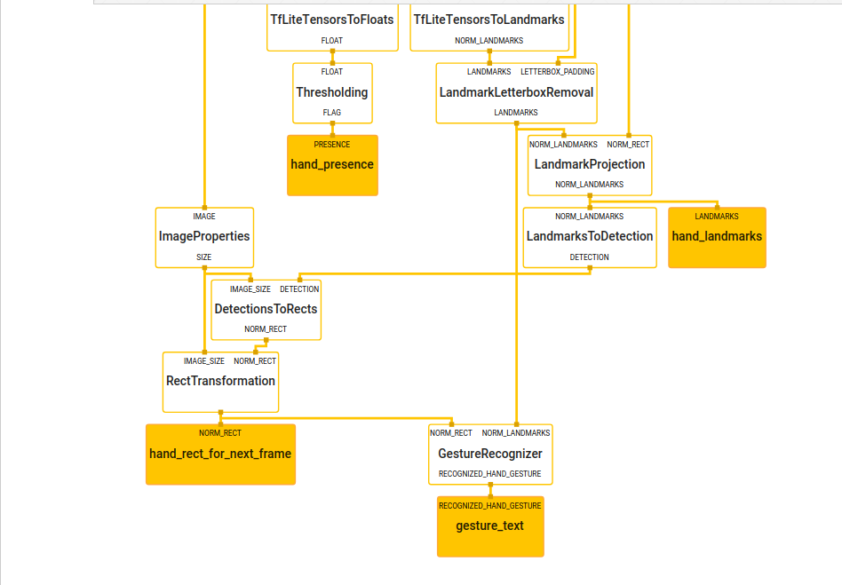

<!--  -->
[](https://travis-ci.org/nodamu/sign-language-recogntion)

# Hand gesture recognition with Mediapipe

[MediaPipe](http://mediapipe.dev) is a framework for building multimodal (eg. video, audio, any time series data), cross platform (i.e Android, iOS, web, edge devices) applied ML pipelines. With MediaPipe, a perception pipeline can be built as a graph of modular components, including, for instance, inference models (e.g., TensorFlow, TFLite) and media processing functions.

## Installation

1. To install mediapipe follow these [instructions](mediapipe/docs/install.md) for linux environments(That's what I use, haven't tested on other OS's).
2. To run the desktop demo via webcam on CPU run

```bash
# This compiles and builds the demo
# It should print:
#Target //mediapipe/examples/desktop/hand_tracking:hand_tracking_cpu up-to-date:
# bazel-bin/mediapipe/examples/desktop/hand_tracking/hand_tracking_cpu
#INFO: Build completed successfully, 12517 total actions
$ bazel build -c opt --define MEDIAPIPE_DISABLE_GPU=1 \
    mediapipe/examples/desktop/hand_tracking:hand_tracking_cpu


# This will open up your webcam as long as it is connected and on
# Any errors is likely due to your webcam being not accessible
$ GLOG_logtostderr=1 bazel-bin/mediapipe/examples/desktop/hand_tracking/hand_tracking_cpu \
    --calculator_graph_config_file=mediapipe/graphs/hand_tracking/hand_tracking_desktop_live.pbtxt
```

3. To run on GPU on desktop run

```bash
# Video from webcam running on desktop GPU
# This works only for linux currently
$ bazel build -c opt --copt -DMESA_EGL_NO_X11_HEADERS \
    mediapipe/examples/desktop/hand_tracking:hand_tracking_gpu

# It should print:
# Target //mediapipe/examples/desktop/hand_tracking:hand_tracking_gpu up-to-date:
#  bazel-bin/mediapipe/examples/desktop/hand_tracking/hand_tracking_gpu
#INFO: Build completed successfully, 22455 total actions

# This will open up your webcam as long as it is connected and on
# Any errors is likely due to your webcam being not accessible,
# or GPU drivers not setup properly.
$ GLOG_logtostderr=1 bazel-bin/mediapipe/examples/desktop/hand_tracking/hand_tracking_gpu \
    --calculator_graph_config_file=mediapipe/graphs/hand_tracking/hand_tracking_mobile.pbtxt
```

## Custom hand gesture recognition calculator built with mediapipe

- 
- <strong>GestureRecognizer calulator</strong>
- It currently uses finger state to detect signs i.e bent, straight relative to thumb
- Currently working on using <em><strong>weighted matching</strong></em>
- To view graph in visualizer, upload [hand_landmark_cpu.pbtxt](https://github.com/nodamu/sign-langage-recogntion/blob/97f4a3cc6d7b98d79ca1b0e1400b20279792c492/mediapipe/graphs/hand_tracking/subgraphs/hand_landmark_cpu.pbtxt) to [MediaPipe Visualizer](https://viz.mediapipe.dev).
